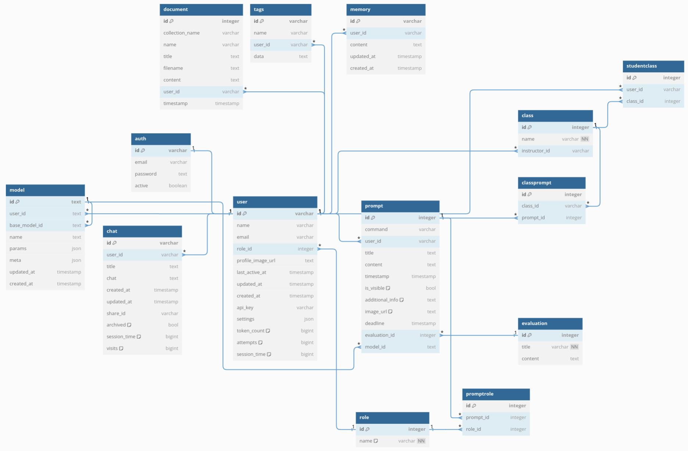

# Database Schema



Generated using https://dbdiagram.io/d with the schema below.

## DBML Structure
```
// Use DBML to define your database structure
// Docs: https://dbml.dbdiagram.io/docs

Table auth {
  id varchar [primary key, ref: - user.id]
  email varchar
  password text
  active boolean

  otp_value integer [null]
  otp_expiry bigint [null]
}

Table chat {
  id varchar [primary key]
  user_id varchar [ref: > user.id]
  title text
  chat text

  created_at timestamp
  updated_at timestamp

  share_id varchar [null, unique]
  archived bool [default: false]

  session_time bigint [default: 0]
  visits bigint [default: 0]

  class_id integer [ref: > class.id]
  prompt_id integer [ref: > prompt.id]
}

Table document {
  id integer [primary key]
  collection_name varchar [unique]
  name varchar [unique]
  title text
  filename text
  content text [null]
  user_id varchar [ref: > user.id]
  timestamp timestamp
}

Table memory {
  id varchar [primary key]
  user_id varchar [ref: > user.id]
  content text
  updated_at timestamp
  created_at timestamp
}

Table model {
  id text [primary key]
  user_id text [ref: > user.id]
  base_model_id text [null, ref: > model.id]
  name text
  params json
  meta json
  updated_at timestamp
  created_at timestamp
}

Table prompt {
  id integer [primary key]
  command varchar [unique]
  user_id varchar [ref: > user.id]
  title text
  content text
  timestamp timestamp
  is_visible bool [default: true]
  additional_info text [default: ""]

  image_url text [default: ""]
  deadline timestamp [null]
  evaluation_id integer [null, ref: > evaluation.id]
  model_id text [null, ref: > model.id]
}

Table promptrole {
  id integer [primary key]
  prompt_id integer [ref: > prompt.id]
  role_id integer [ref: > role.id]
}

Table role {
  id integer [primary key]
  name varchar [not null, default: "pending", unique]
}

Table tags {
  id varchar [primary key]
  name varchar
  user_id varchar [ref: > user.id]
  data text [null]
}

Table user {
  id varchar [primary key]
  name varchar
  email varchar
  role_id integer [ref: > role.id]
  profile_image_url text

  last_active_at timestamp
  updated_at timestamp
  created_at timestamp

  api_key varchar [null, unique]
  settings json [null]

  token_count bigint [default: 0]
  attempts bigint [default: 0]
  session_time bigint [default: 0]
}

Table evaluation {
  id integer [primary key]
  title varchar [not null, unique]
  content text [default: ""]
}

Table studentclass {
  id integer [primary key]
  user_id varchar [ref: > user.id]
  class_id integer [ref: > class.id]
}

Table class {
  id integer [primary key]
  name varchar [not null, unique]
  instructor_id varchar [ref: > user.id]
}

Table classprompt {
  id integer [primary key]
  class_id varchar [ref: > class.id]
  prompt_id integer [ref: > prompt.id]
}
```